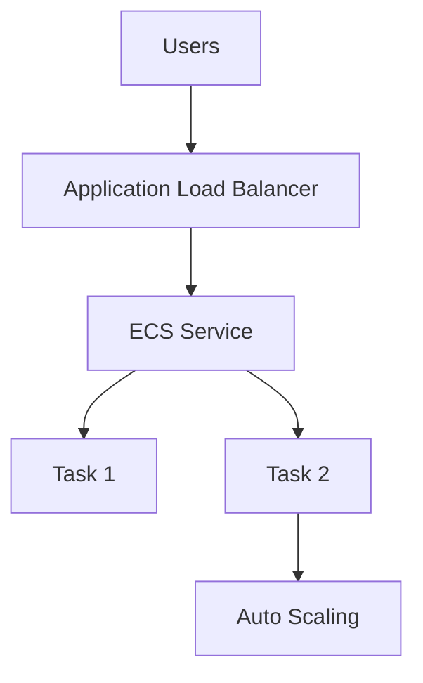
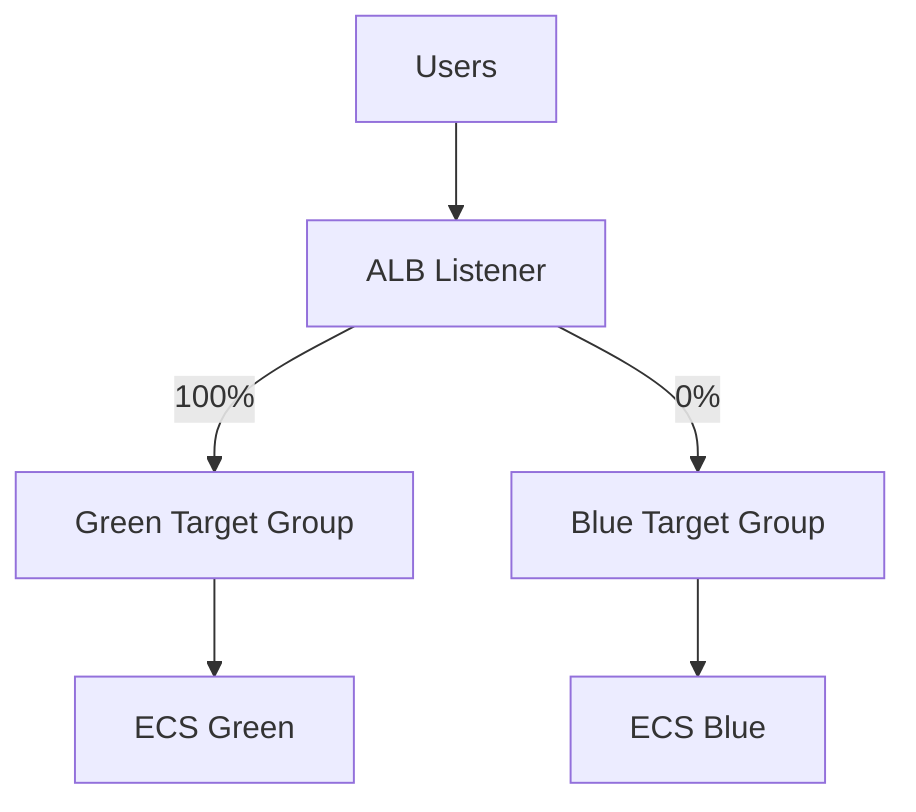
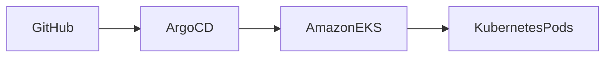
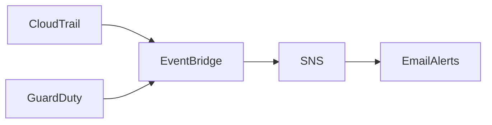
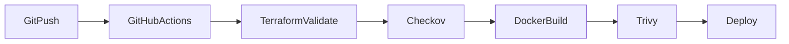
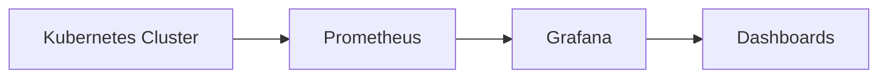

# 🚀 Cloud Platform & Infrastructure Security Portfolio

### **Wandy Torres**

**Platform Engineer | Infrastructure Security Engineer | Cloud Engineer**

---

## 📖 Overview

Welcome to my Cloud Engineering portfolio.

This repository documents my hands-on journey building **production-style cloud infrastructure**, **DevOps pipelines**, **Kubernetes platforms**, **Infrastructure Security**, and **Cloud Native Security** using AWS.

Every project is built following Infrastructure as Code (IaC), automation, security best practices, and production-ready architectures.

The goal of this repository is to demonstrate practical experience with modern Platform Engineering and Infrastructure Security technologies through real-world projects.

---

# 🏗️ Architecture Overview

## Production Architecture (ECS + ALB + Auto Scaling)



---

## Blue / Green Deployment



---

## GitOps Architecture



---

## Detection-as-Code



---

## DevSecOps Pipeline



---

# 🚀 Projects

---

# Project 1 – Static Website (Amazon S3 + CloudFront)

### Technologies

* Amazon S3
* CloudFront

### Highlights

* Static website hosting
* CDN implementation
* Bucket policies

---

# Project 2 – Terraform S3

### Technologies

* Terraform

### Highlights

* Infrastructure as Code
* Terraform lifecycle
* Automated provisioning

---

# Project 3 – Terraform + CloudFront

### Highlights

* Automated CDN deployment
* Static website automation

---

# Project 4 – EC2 + Nginx

### Technologies

* EC2
* Nginx
* Terraform

### Highlights

* EC2 provisioning
* User Data automation
* Linux administration

---

# Project 5 – Terraform CI/CD

### Highlights

* GitHub Actions
* Terraform automation
* Infrastructure deployment

---

# Project 6 – Secure CI/CD (OIDC)

### Highlights

* GitHub OIDC
* IAM Roles
* Removed AWS Access Keys

---

# Project 7 – Multi-Environment Terraform

### Highlights

* Terraform Modules
* Dev / Production environments
* tfvars
* Reusable Infrastructure

---

# Project 8 – Docker + EC2

### Highlights

* Docker
* Container deployment
* Automated deployments

---

# Project 9 – ECS + Amazon ECR

### Highlights

* Amazon ECS
* Amazon ECR
* Rolling deployments

---

# Project 10 – ECS Production Architecture

### Technologies

* ECS
* ALB
* Auto Scaling

### Highlights

* Production-like architecture
* Health Checks
* Auto Scaling
* Load Balancing

---

# Project 11 – Blue / Green Deployment

### Highlights

* Blue/Green deployment
* Weighted Routing
* Zero Downtime deployment
* Rollback strategy

---

# Project 12 – HTTPS + ACM

### Technologies

* ACM
* Route53
* ALB

### Highlights

* HTTPS
* SSL/TLS
* Custom Domain
* DNS Validation

---

# Project 13 – Kubernetes (Amazon EKS)

### Technologies

* Amazon EKS
* Terraform
* Kubernetes

### Highlights

* Managed Node Groups
* Kubernetes Deployments
* LoadBalancer Services
* kubectl administration

---

# Project 14 – DevSecOps

### Technologies

* GitHub Actions
* Checkov
* Trivy

### Highlights

* Infrastructure Security Scanning
* Container Vulnerability Scanning
* Security Gates
* DevSecOps Pipeline

---

# Project 15 – GitOps with ArgoCD

### Technologies

* ArgoCD
* Amazon EKS

### Highlights

* GitOps
* Declarative Deployments
* Continuous Synchronization
* Kubernetes Application Management

---

# Project 16 – Detection-as-Code

### Technologies

* Terraform
* EventBridge
* SNS
* GuardDuty
* CloudTrail

### Highlights

Implemented cloud-native detections for:

* Root Login
* Failed Console Login
* IAM Changes
* Security Group Changes
* GuardDuty Findings

Integrated automated email alerts using Amazon SNS.

---

# Project 17 – Kubernetes Security

### Technologies

* Kubernetes
* RBAC
* Network Policies
* Secrets

### Highlights

* Role-Based Access Control (RBAC)
* Kubernetes Secrets
* Zero Trust Networking
* Network Policies
* Kubernetes Security Best Practices

---

# 🚧 Current Project

## Project 18 – Kubernetes Runtime Security

Technologies

* Amazon EKS
* Falco
* Runtime Security
* Helm

Objectives

* Runtime Threat Detection
* Container Escape Detection
* Reverse Shell Detection
* Custom Falco Rules
* Runtime Security Monitoring

---
## 📊 Project 19 – Kubernetes Observability



- Installed Prometheus Operator
- Installed Grafana
- Collected Kubernetes metrics
- Monitored Nodes, Pods and Containers
- Validated cluster observability
- Simulated workload scaling
- Visualized CPU and Memory utilization
# 🛠️ Tech Stack

### Cloud

* AWS

  * EC2
  * ECS
  * EKS
  * ECR
  * ALB
  * ACM
  * IAM
  * SNS
  * CloudWatch
  * EventBridge
  * GuardDuty
  * Route53

### Infrastructure

* Terraform

### Containers

* Docker

### Kubernetes

* Amazon EKS
* kubectl
* ArgoCD

### CI/CD

* GitHub Actions

### DevSecOps

* Checkov
* Trivy

### Operating Systems

* Linux
* Ubuntu

### Scripting

* Bash

---

# 🎯 Skills Demonstrated

* DevSecOps
* Detection-as-Code
* Infrastructure Security
* Cloud Native Security
* Container Security
* Runtime Security (Falco)
* Kubernetes Security
* Kubernetes Observability
* CI/CD Automation
* Auto Scaling
* Blue/Green Deployments
* Cloud Monitoring
* Prometheus & Grafana
* IAM
* Zero Trust Concepts

---

# 📚 Roadmap

✅ Project 1 — S3 + CloudFront

✅ Project 2 — Terraform S3

✅ Project 3 — CloudFront Automation

✅ Project 4 — EC2 + Nginx

✅ Project 5 — Terraform CI/CD

✅ Project 6 — OIDC Authentication

✅ Project 7 — Multi-Environment Terraform

✅ Project 8 — Docker

✅ Project 9 — ECS + ECR

✅ Project 10 — ECS Production (ALB + Auto Scaling)

✅ Project 11 — Blue / Green Deployment

✅ Project 12 — HTTPS + ACM

✅ Project 13 — Amazon EKS

✅ Project 14 — DevSecOps Pipeline

✅ Project 15 — GitOps with ArgoCD

✅ Project 16 — Detection-as-Code

✅ Project 17 — Kubernetes Security

✅ Project 18 — Kubernetes Runtime Security (Falco)

✅ Project 19 — Kubernetes Observability (Prometheus + Grafana)

🔜 Project 20 — Zero Trust Kubernetes

🔜 Project 21 — Kubernetes Autoscaling (HPA + Cluster Autoscaler)

🔜 Project 22 — Ansible Automation

🔜 Project 23 — AWS Security Hub & GuardDuty

🔜 Project 24 — Platform Engineering

🔜 Project 25 — Service Mesh (Istio)

🔜 Project 26 — Kafka on Kubernetes

🔜 Project 27 — GitHub Actions Enterprise CI/CD

🔜 Project 28 — Production Platform Engineering

---

# 📷 Repository Structure

```text
.
├── project-1-s3-cloudfront
├── project-2-terraform-s3
├── project-3-terraform-cloudfront
├── project-4-terraform-ec2-nginx
├── project-8-docker-app
├── project-10-terraform-ecs-alb
├── project-11-ecs-blue-green
├── project-13-eks
├── project-14-devsecops
├── project-15-gitops
├── project-16-detection-as-code
├── project-17-kubernetes-security
├── project-18-runtime-security
├── project-19-observability
├── environments
├── modules
└── terraform-backend
```

---

# 👨‍💻 Author

**Wandy Torres**

**Platform Engineer | Infrastructure Security Engineer | Cloud Engineer**

🇩🇴 Dominican Republic

AWS • Kubernetes • Terraform • Docker • GitOps • DevSecOps • Observability • Platform Engineering
