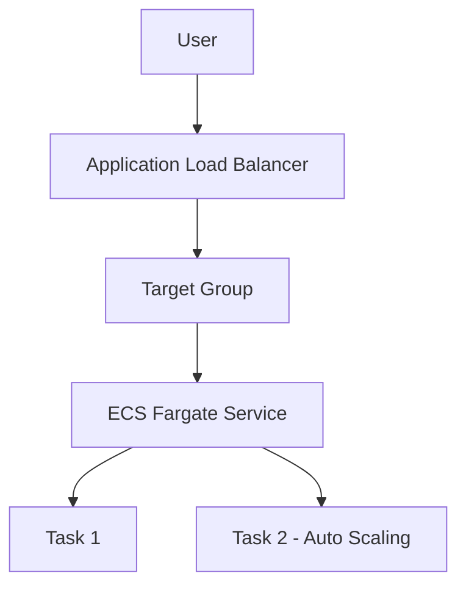
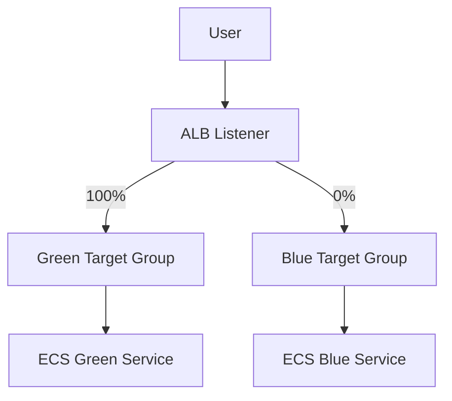
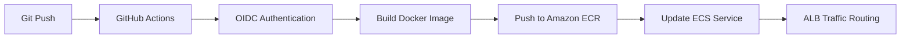
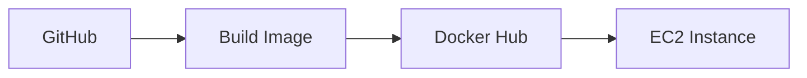
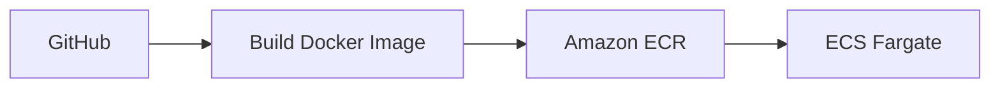
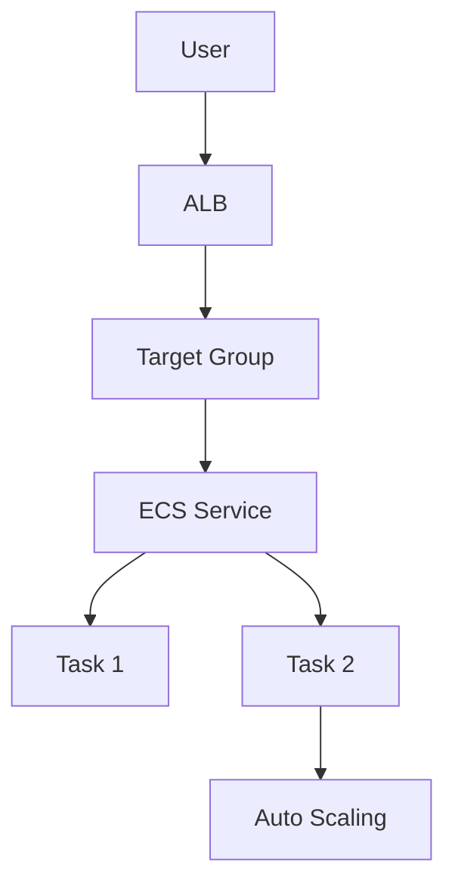
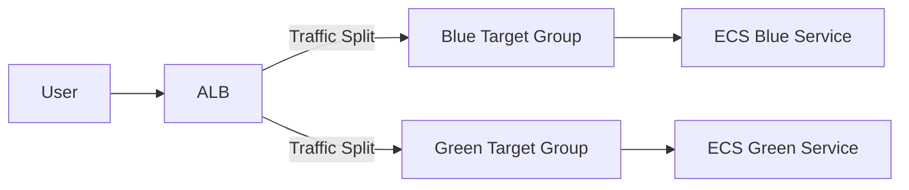

# 🚀 DevOps & Cloud Journey – Wandy Torres

This repository documents my journey to becoming a **Cloud & DevOps Engineer**, building real-world infrastructure using AWS, Terraform, Docker, and CI/CD pipelines.

---

# 🌐 Architecture Overview

## 🔥 Production Architecture (ECS + ALB + Auto Scaling)



---

## 🔄 Blue/Green Deployment Architecture (ALB Weighted Routing)



---

## ⚙️ CI/CD Pipeline



---

## 🧠 Deployment Flow

```text
Developer → Git Push
           ↓
GitHub Actions Pipeline
           ↓
Build Docker Image
           ↓
Push to Amazon ECR
           ↓
Register New Task Definition
           ↓
ECS Rolling Deployment
           ↓
ALB Routes Traffic to Healthy Containers
```

---

# 🧱 Projects

## 🔹 Project 1 – Static Website (S3 + CloudFront)

* Deployed static website using S3
* Configured CloudFront for CDN delivery
* Managed bucket policies

---

## 🔹 Project 2 – Terraform S3

* Provisioned S3 using Terraform (IaC)
* Practiced Terraform lifecycle commands
* Introduced infrastructure automation

---

## 🔹 Project 3 – Terraform + CloudFront

* Automated full static deployment
* Managed CDN behavior and propagation

---

## 🔹 Project 4 – EC2 + Nginx (Terraform)

* Deployed EC2 instance
* Automated Nginx setup with `user_data`
* Exposed service via public IP

---

## 🔹 Project 5 – CI/CD Pipeline

* Automated Terraform deployments
* Built CI/CD workflows using GitHub Actions

---

## 🔹 Project 6 – CI/CD Security (OIDC)

* Removed AWS Access Keys
* Implemented OIDC authentication
* Configured IAM roles securely

---

## 🔹 Project 7 – Multi-Environment Terraform

* Created reusable modules
* Implemented dev/prod separation
* Used `terraform.tfvars`
* Integrated CI/CD per environment

---

## 🚀 Project 8 – Docker + EC2 Deployment



* Containerized application
* Automated deployment via SSH
* Replaced manual server setup

---

## ☁️ Project 9 – ECS Fargate + ECR



* Implemented serverless containers
* Built cloud-native deployment pipeline
* Enabled rolling deployments

---

## 🌐 Project 10 – ECS + ALB + Auto Scaling



* Built production-like infrastructure using Terraform
* Implemented Application Load Balancer
* Configured health checks with Target Group
* Enabled ECS Auto Scaling (CPU-based)
* Achieved dynamic scaling of containers

---

## 🔄 Project 11 – Blue/Green Deployment (ALB Weighted Routing)

* Implemented Blue/Green deployment strategy without CodeDeploy
* Created separate **Blue and Green ECS services**
* Configured **ALB weighted routing between target groups**
* Tested traffic shifting (100% Blue → 50/50 → 100% Green)
* Enabled safer deployments with rollback capability



---

# ⚙️ CI/CD Workflows

* `deploy-dev.yml` → automatic deployment (dev)
* `deploy-prod.yml` → manual deployment (prod)
* `deploy-ecs.yml` → Docker build + ECS deploy
* `destroy.yml` → controlled infrastructure teardown

### Features

* Terraform automation (`init`, `validate`, `plan`, `apply`)
* Docker build and push pipelines
* OIDC authentication (secure)
* Environment-based deployments
* Rolling deployments in ECS

---

# 🔐 Security Best Practices

* No static AWS credentials
* OIDC federation with GitHub
* Least-privilege IAM roles
* Environment isolation
* Secure CI/CD pipelines

---

# 📊 Monitoring & Observability

* CloudWatch Alarms (CPU, Memory, ALB errors)
* SNS email notifications
* CloudWatch Dashboard (real-time metrics)
* ECS service health monitoring

---

# 📦 Tech Stack

* AWS (S3, EC2, ECS, ECR, ALB, IAM, CloudWatch)
* Terraform
* Docker
* GitHub Actions
* Linux

---

# 🧠 Skills Demonstrated

* Infrastructure as Code (Terraform)
* CI/CD Pipeline Design
* Cloud Architecture (AWS)
* Containerization (Docker)
* Orchestration (ECS)
* Auto Scaling & Load Balancing
* Blue/Green Deployment Strategies
* Monitoring & Alerting
* Security Best Practices

---

# 🚀 Next Steps

* 🔒 HTTPS with ACM + Domain
* 📊 Advanced Monitoring Dashboards
* 🔄 Canary Deployments
* ☸️ Kubernetes (EKS)

---

# 👨‍💻 Author

**Wandy Torres**
Cloud & DevOps Engineer in progress 🚀
