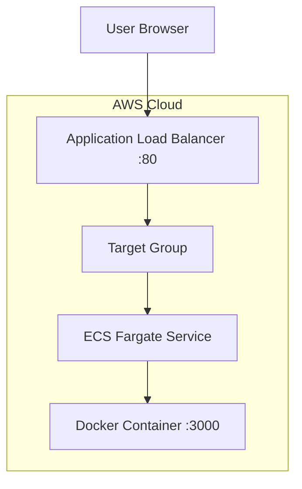
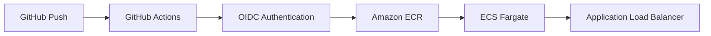
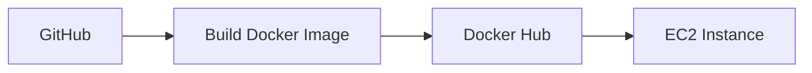
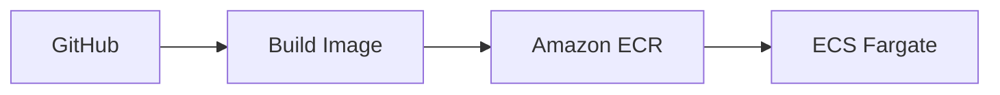

# 🚀 DevOps & Cloud Journey – Wandy Torres

This repository documents my journey to becoming a **Cloud & DevOps Engineer**, building real-world infrastructure using AWS, Terraform, Docker, and CI/CD pipelines.

---

# 🌐 Architecture Overview

## 🔥 Current Production Architecture



---

## ⚙️ CI/CD Pipeline Architecture



---

## 🧠 Deployment Flow

```text
Developer → Git Push
           ↓
GitHub Actions Pipeline
           ↓
Build Docker Image
           ↓
Push to Amazon ECR
           ↓
Register New Task Definition
           ↓
ECS Rolling Deployment
           ↓
ALB Routes Traffic to Healthy Containers
```

---

# 🧱 Projects

## 🔹 Project 1 – Static Website (S3 + CloudFront)

* Deployed static site using S3
* Configured CloudFront for CDN delivery
* Implemented bucket policies

---

## 🔹 Project 2 – Terraform S3

* Provisioned S3 using Terraform
* Introduced Infrastructure as Code
* Practiced Terraform lifecycle

---

## 🔹 Project 3 – Terraform + CloudFront

* Automated full static site deployment
* Managed CDN lifecycle

---

## 🔹 Project 4 – EC2 + Nginx (Terraform)

* Deployed EC2 instance
* Automated Nginx setup
* Exposed service via public IP

---

## 🔹 Project 5 – CI/CD Pipeline

* Automated Terraform deployments
* Implemented GitHub Actions workflows

---

## 🔹 Project 6 – CI/CD Security (OIDC)

* Eliminated static credentials
* Configured IAM role with OIDC
* Secured pipelines

---

## 🔹 Project 7 – Multi-Environment Terraform

* Created reusable modules
* Implemented dev/prod separation
* Integrated CI/CD per environment

---

## 🚀 Project 8 – Docker + EC2 Deployment



* Containerized application
* Automated deployment via SSH
* Replaced manual server setup

---

## ☁️ Project 9 – ECS Fargate + ECR



* Implemented serverless containers
* Built cloud-native deployment pipeline
* Enabled rolling deployments

---

## 🌐 Project 10 – ECS + ALB + Auto Scaling

flowchart TD
    A[User] --> B[ALB :80]
    B --> C[Target Group]
    C --> D[ECS Service]
    D --> E[Task 1]
    D --> F[Task 2 - Auto Scaling]

* Built production-like infrastructure using Terraform
* Implemented ALB with health checks
* Configured ECS Auto Scaling
* Enabled dynamic scaling (1–2 tasks)

---

# ⚙️ CI/CD Workflows

* `deploy-dev.yml` → automatic deployment (dev)
* `deploy-prod.yml` → manual deployment (prod)
* `deploy-ecs.yml` → Docker build + ECS deploy
* `destroy.yml` → controlled teardown

---

# 🔐 Security Best Practices

* OIDC authentication (no AWS keys)
* Least-privilege IAM roles
* Environment-based restrictions
* Secure CI/CD pipelines

---

# 📦 Tech Stack

* AWS (S3, EC2, ECS, ECR, ALB, IAM, CloudWatch)
* Terraform
* Docker
* GitHub Actions
* Linux

---

# 🧠 Skills Demonstrated

* Infrastructure as Code (Terraform)
* CI/CD Pipeline Design
* Cloud Architecture (AWS)
* Containerization & Orchestration
* Auto Scaling & Load Balancing
* Security Best Practices

---

# 🚀 Next Steps

* 🔒 HTTPS with ACM + Domain
* 📊 Monitoring & Alerting (CloudWatch)
* 🔄 Blue/Green Deployments
* ☸️ Kubernetes (EKS)

---

# 👨‍💻 Author

**Wandy Torres**
Cloud & DevOps Engineer in progress 🚀
