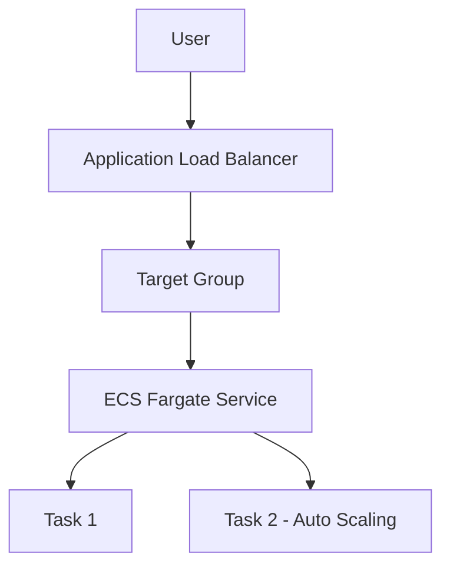
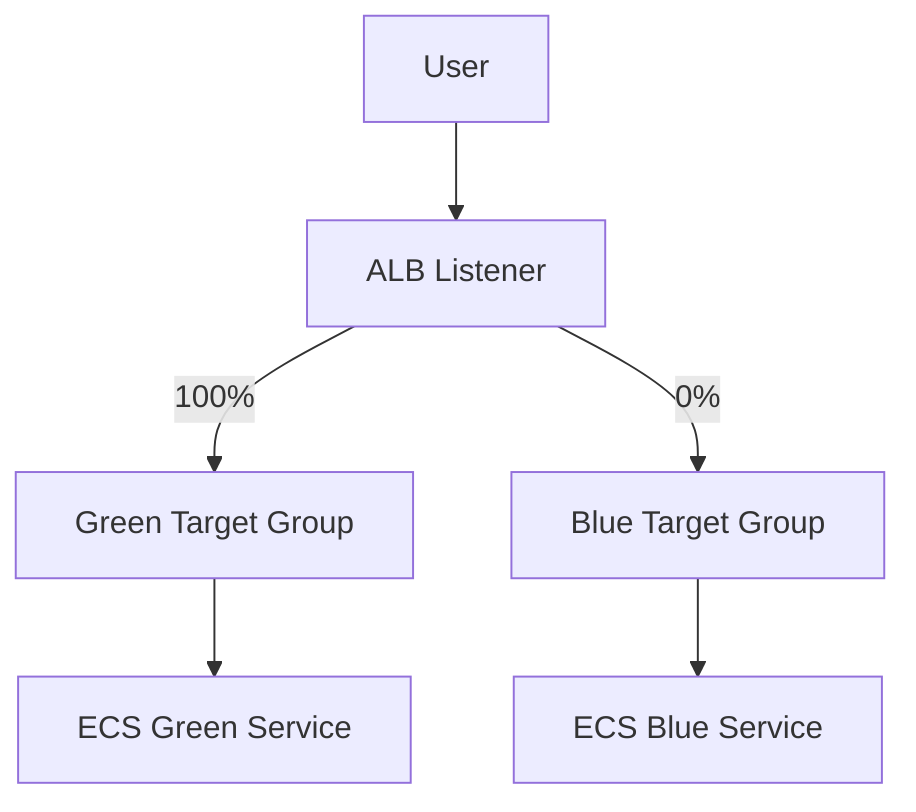
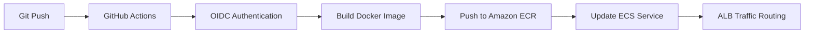
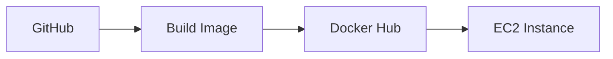
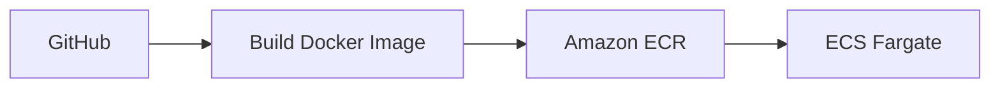
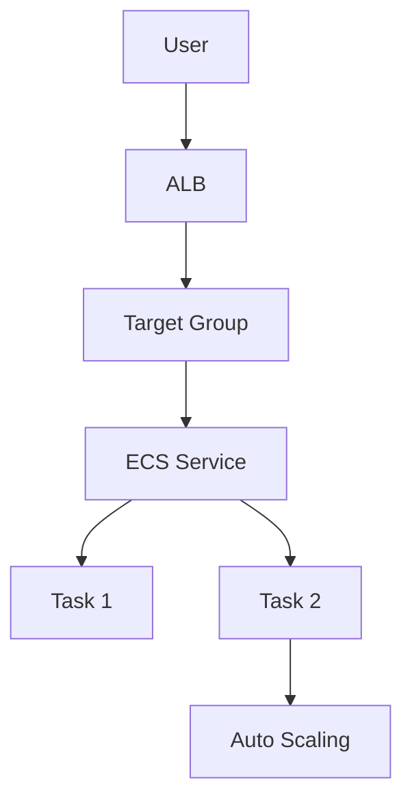
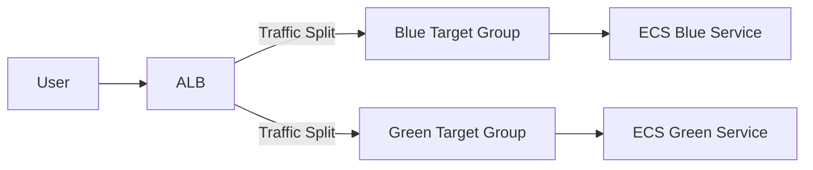
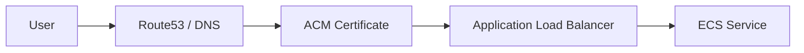
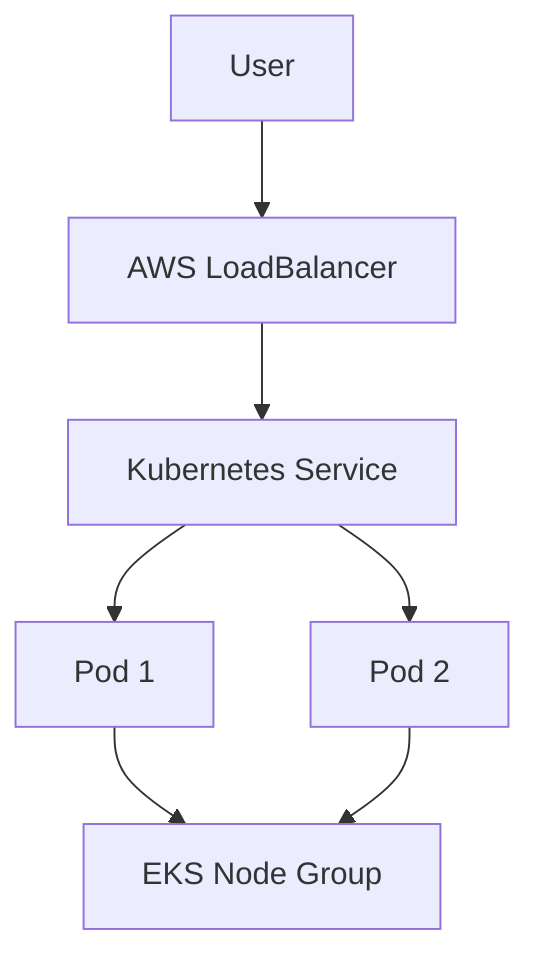
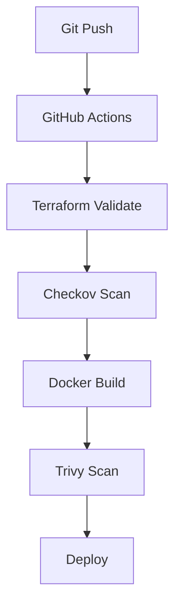

# 🚀 Platform Engineer-Infrastructure Security Engineer-Cloud Engineer – Wandy Torres

This repository documents my journey to becoming a **Platform Engineer-Infrastructure Security Engineer-Cloud Engineer**, building real-world infrastructure using AWS, Terraform, Docker, and CI/CD pipelines.

---

# 🌐 Architecture Overview

## 🔥 Production Architecture (ECS + ALB + Auto Scaling)



---

## 🔄 Blue/Green Deployment Architecture (ALB Weighted Routing)



---

## ⚙️ CI/CD Pipeline



---

## 🧠 Deployment Flow

```text
Developer → Git Push
           ↓
GitHub Actions Pipeline
           ↓
Build Docker Image
           ↓
Push to Amazon ECR
           ↓
Register New Task Definition
           ↓
ECS Rolling Deployment
           ↓
ALB Routes Traffic to Healthy Containers
```

---

# 🧱 Projects

## 🔹 Project 1 – Static Website (S3 + CloudFront)

* Deployed static website using S3
* Configured CloudFront for CDN delivery
* Managed bucket policies

---

## 🔹 Project 2 – Terraform S3

* Provisioned S3 using Terraform (IaC)
* Practiced Terraform lifecycle commands
* Introduced infrastructure automation

---

## 🔹 Project 3 – Terraform + CloudFront

* Automated full static deployment
* Managed CDN behavior and propagation

---

## 🔹 Project 4 – EC2 + Nginx (Terraform)

* Deployed EC2 instance
* Automated Nginx setup with `user_data`
* Exposed service via public IP

---

## 🔹 Project 5 – CI/CD Pipeline

* Automated Terraform deployments
* Built CI/CD workflows using GitHub Actions

---

## 🔹 Project 6 – CI/CD Security (OIDC)

* Removed AWS Access Keys
* Implemented OIDC authentication
* Configured IAM roles securely

---

## 🔹 Project 7 – Multi-Environment Terraform

* Created reusable modules
* Implemented dev/prod separation
* Used `terraform.tfvars`
* Integrated CI/CD per environment

---

## 🚀 Project 8 – Docker + EC2 Deployment



* Containerized application
* Automated deployment via SSH
* Replaced manual server setup

---

## ☁️ Project 9 – ECS Fargate + ECR



* Implemented serverless containers
* Built cloud-native deployment pipeline
* Enabled rolling deployments

---

## 🌐 Project 10 – ECS + ALB + Auto Scaling



* Built production-like infrastructure using Terraform
* Implemented Application Load Balancer
* Configured health checks with Target Group
* Enabled ECS Auto Scaling (CPU-based)
* Achieved dynamic scaling of containers

---

## 🔄 Project 11 – Blue/Green Deployment (ALB Weighted Routing)

* Implemented Blue/Green deployment strategy without CodeDeploy
* Created separate **Blue and Green ECS services**
* Configured **ALB weighted routing between target groups**
* Tested traffic shifting (100% Blue → 50/50 → 100% Green)
* Enabled safer deployments with rollback capability



# README Updates (Projects 12–14)

## 🔒 Project 12 – HTTPS + ACM + Custom Domain



* Created a custom subdomain (`devops.asomap.com.do`)
* Issued and validated ACM SSL/TLS certificates
* Configured HTTPS listener on ALB
* Implemented DNS validation using CNAME records
* Enabled secure end-to-end traffic encryption

---

## ☸️ Project 13 – Kubernetes (EKS)



* Provisioned Amazon EKS using Terraform
* Created Managed Node Groups
* Configured kubectl access and authentication
* Deployed containerized applications using Kubernetes Deployments
* Exposed applications using Kubernetes Services (LoadBalancer)
* Managed Kubernetes resources declaratively

---

## 🔐 Project 14 – DevSecOps Security Pipeline



* Integrated Checkov security scanning for Terraform
* Integrated Trivy vulnerability scanning for Docker images
* Implemented DevSecOps security gates in GitHub Actions
* Reduced Terraform security findings through remediation
* Improved container security posture using hardened base images
* Applied Infrastructure-as-Code security best practices

---

## 📦 Updated Tech Stack

* AWS (S3, EC2, ECS, EKS, ECR, ALB, ACM, IAM, CloudWatch, SNS)
* Terraform
* Docker
* Kubernetes
* GitHub Actions
* DevSecOps (Checkov, Trivy)
* Linux

---

## 🧠 Updated Skills Demonstrated

* Infrastructure as Code (Terraform)
* Cloud Architecture (AWS)
* Containerization (Docker)
* Kubernetes Administration (EKS)
* CI/CD Pipeline Design
* DevSecOps Practices
* Security Scanning & Vulnerability Management
* Blue/Green Deployments
* Auto Scaling & Load Balancing
* HTTPS & Certificate Management
* Monitoring & Alerting
* Infrastructure Security Engineering

---

## 🚀 Next Steps

* Project 15 – GitOps with ArgoCD
* Project 16 – Detection as Code
* Project 17 – GuardDuty + Security Hub
* Project 18 – EKS Production Architecture

```
```
