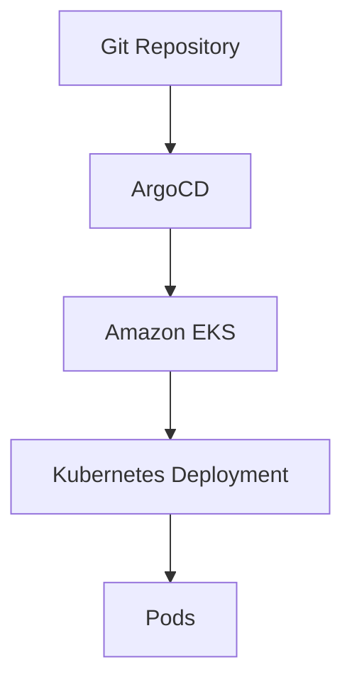
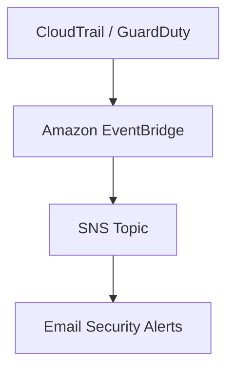
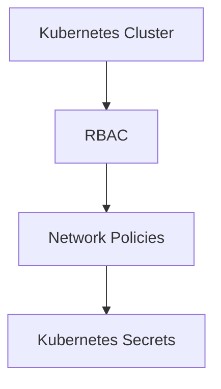

# 🚀 Platform Engineer | Infrastructure Security Engineer | Cloud Engineer – Wandy Torres

This repository showcases my hands-on journey building **production-style cloud platforms**, secure infrastructure, Kubernetes environments, GitOps pipelines, DevSecOps automation, and Detection-as-Code solutions on AWS.

The projects simulate real-world enterprise environments using Infrastructure as Code (Terraform), Kubernetes (Amazon EKS), GitOps (ArgoCD), DevSecOps security scanning, cloud-native monitoring, and modern infrastructure security practices.

---

# 🚀 Project 15 – GitOps with ArgoCD

### Highlights

* Implemented GitOps workflows using ArgoCD
* Automated Kubernetes application synchronization
* Managed Kubernetes manifests directly from Git
* Enabled declarative application deployments
* Implemented continuous reconciliation between Git and Kubernetes

---

# 🚨 Project 16 – Detection as Code

### Highlights

* Built Detection-as-Code using Terraform
* Created EventBridge rules for:

  * Root Login Detection
  * Failed Console Login
  * IAM Policy Changes
  * Security Group Changes
  * GuardDuty Findings
* Automated security notifications using Amazon SNS
* Implemented cloud-native security monitoring

---

# 🛡️ Project 17 – Kubernetes Security

### Highlights

* Implemented Kubernetes Role-Based Access Control (RBAC)
* Applied Zero Trust networking using Network Policies
* Managed sensitive data using Kubernetes Secrets
* Prepared runtime security architecture for Falco integration
* Applied Kubernetes security best practices

---

# 📦 Updated Tech Stack

* AWS (EC2, ECS, EKS, ECR, ALB, IAM, ACM, Route53, CloudWatch, SNS, EventBridge, GuardDuty)
* Terraform
* Docker
* Kubernetes
* ArgoCD
* GitHub Actions
* DevSecOps

  * Trivy
  * Checkov
* Detection-as-Code
* Linux
* Git
* Bash

---

# 🧠 Skills Demonstrated

* Cloud Architecture
* Platform Engineering
* Infrastructure as Code (Terraform)
* Amazon EKS Administration
* GitOps (ArgoCD)
* DevSecOps
* Detection-as-Code
* Kubernetes Security
* Infrastructure Security
* Container Security
* Cloud Native Security
* Blue/Green Deployments
* Auto Scaling
* CI/CD
* Cloud Monitoring
* Security Automation

---

# 🚀 Upcoming Projects

* Project 18 – Kubernetes Runtime Security (Falco)
* Project 19 – Zero Trust Kubernetes
* Project 20 – AI-Enabled Security Automation
* Project 21 – Prometheus + Grafana Observability
* Project 22 – Ansible Automation
* Project 23 – AWS Security Hub
* Project 24 – Multi-Cluster Platform Engineering
