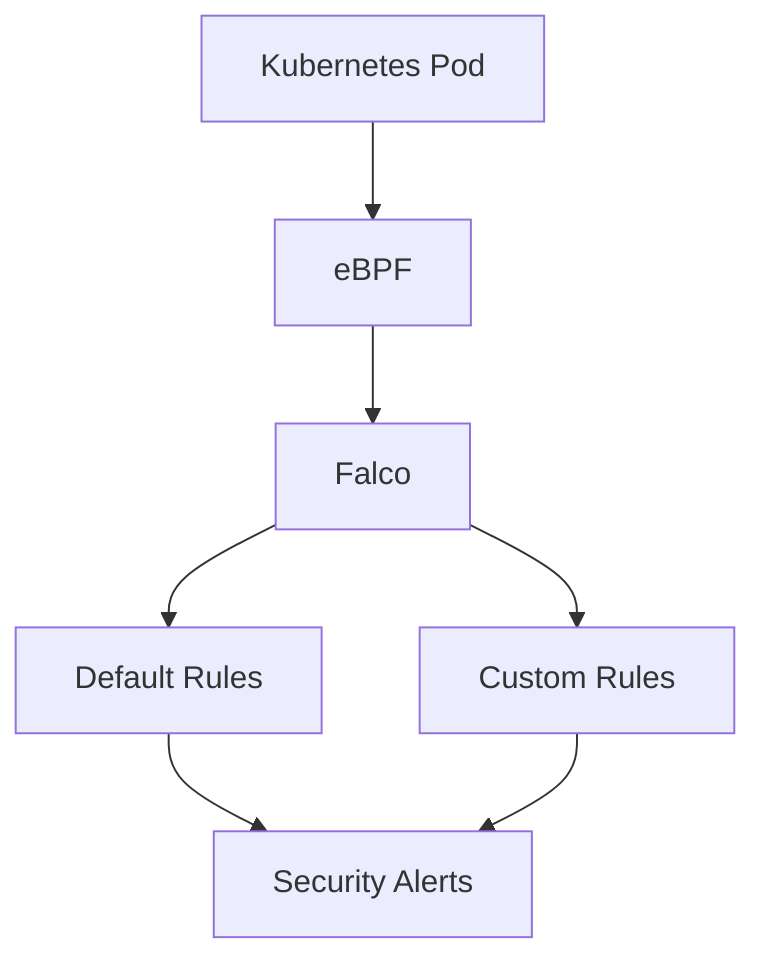

## 🛡️ Project 18 – Runtime Security with Falco

### Features

- Installed Falco on Amazon EKS using Helm
- Monitored Linux syscalls through eBPF
- Detected interactive shells inside Kubernetes containers
- Developed custom runtime detection rules
- Validated runtime security events
- Implemented Kubernetes Runtime Threat Detection

## Skills Demonstrated

- Runtime Security
- Kubernetes Security
- Falco
- eBPF
- Threat Detection
- Security Monitoring
- Detection Engineering
- Custom Detection Rules
